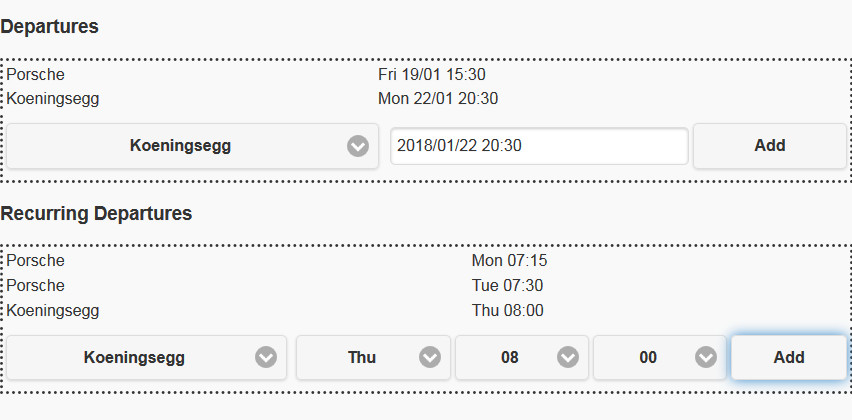

# HassCarEngineHeater
A very simple web UI for starting electrical car engine heater for oneshot and weekly recurring car departures for the [Home assistant](https://www.home-assistant.io) home automation application.

# Installation
1. clone repo
1. cd HassCarEngineHeater
1. install dependencies (see requirements.txt)
1. copy config.json_sample to config.json
1. edit config.json to your liking
1. run 'python carengineheater.py' (run in screen or tmux to easily leave application running in background)
1. Do _not_ run it on an untrusted network and keep it away from internet. There is no password or protection or safety within this application. 

# Usage
* load up the web UI, ip of machine running HassCarEngineHeater, port 5000
* Use the web UI to add one shot departures and weekly recurring departures
* you can change some values/times by double clicking them
* you can remove departures and recurring departures by swiping them

# Example / Screenshot

